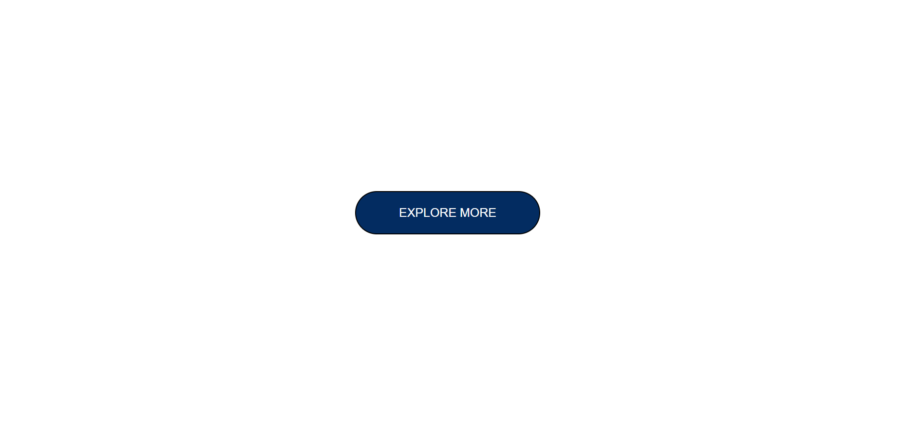

# Button challenge 3 #
[project-live](https://buttonchallenge3.netlify.app)
  - - - -
 # Technology used in this project #
     
    - - - -
* Skill Gained in this project
  * Learned to create buttons using __padding, border, heigth , width, border-radius and bg-clor__
  *  Learned to change the effect in the button using __hover__
  * Lerned to conver lowercase letter to __uppercase__
   - - - -
 ## Time taken to complete this project ##
 *  30  minutes to completed this poject
 
 ## Screenshot ##
 
 
 
